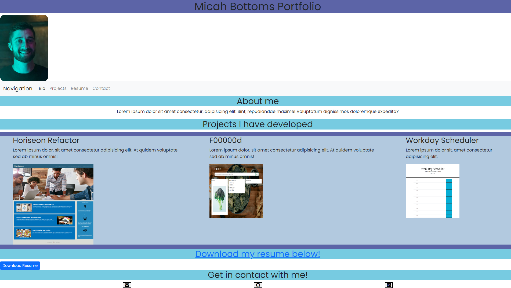

# micah_bottoms_portfolio

Micah Bottoms' professional portfolio

## Description

This project is my professional portfolio. No starter code was given and the instructions were to create a functional webpage with links to projects, bio and contact information.

## Installation

The repository can be found here: https://github.com/mbottoms3/micah_bottoms_portfolio

The website can be found here: https://mbottoms3.github.io/micah_bottoms_portfolio/

